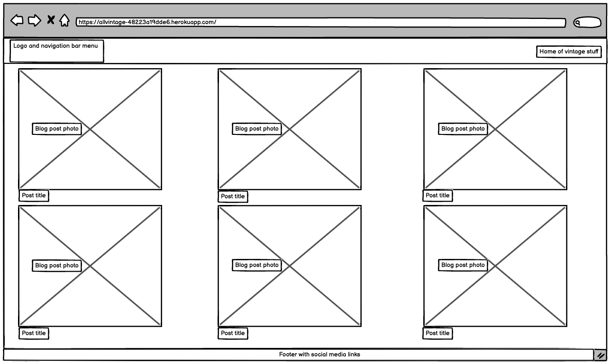
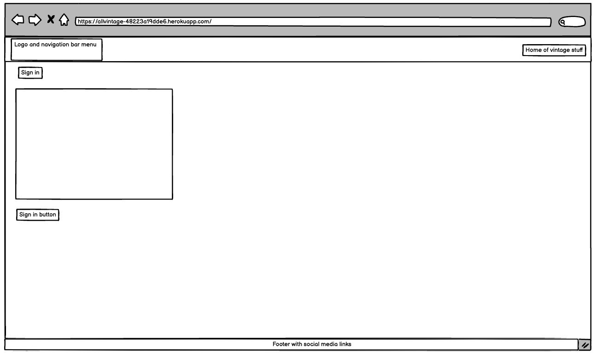
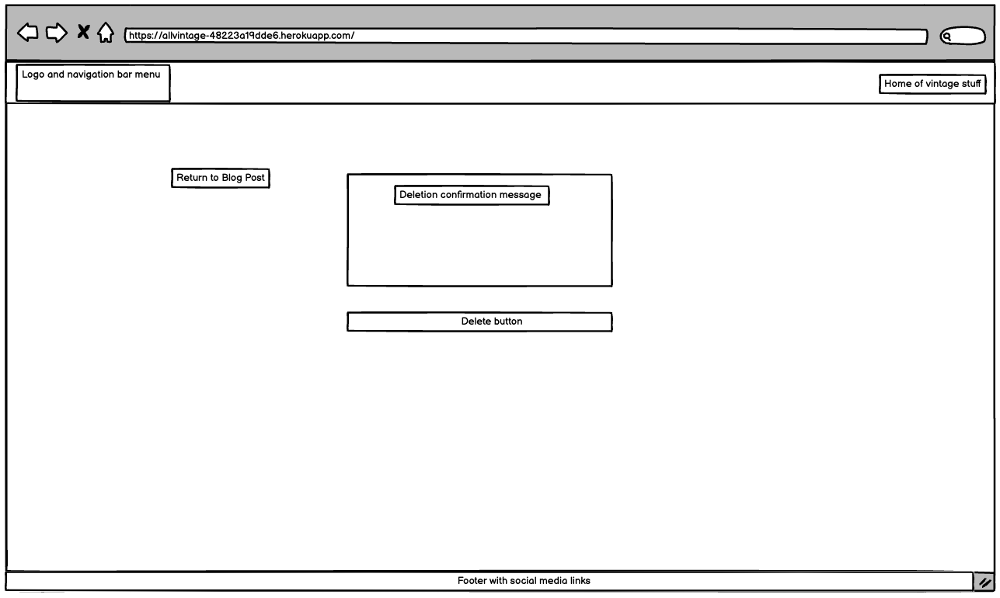
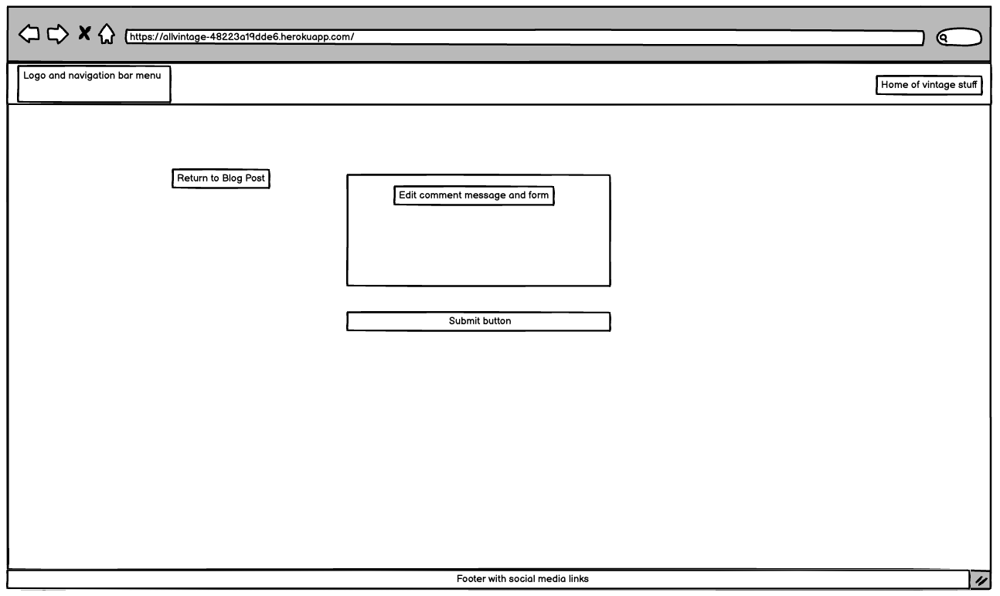
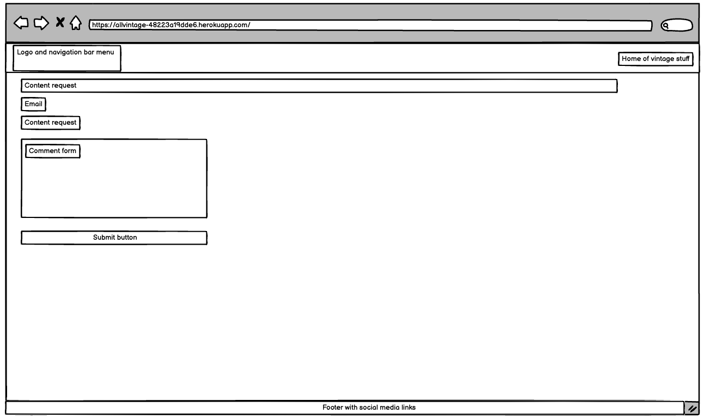
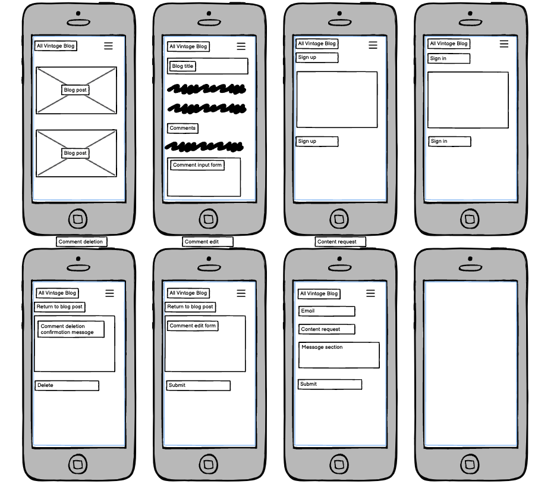

# AllVintage Blog

Blog for all vintage stuff enthusiasts.

## Project status update

This project has been created for the purpose of completion of Project 4. The base of the project is influenced by Code Institute blog walkthrough project.
In line with Project 4 requirements an addtitional functionality was created to allow users to submit blog content requests.

Due to time constraints and some some challenges with deployment to Heroku, the project is incomplete at the time of the submission.
The remaining aspect, which need to completed are as follows:
-completion of CRUD functonality specifically to allow logged users to delete and amend their comments
-additional styling is required to make the blog more appealing to users
-code testing 
-code commenting across code files
-completion of the readme document, including database schema and wireframes

## Project 4

### Background

## Design 

## Solution 

## Wireframes

In the process of development a subset of wireframes have been created using Balsamiq application.
Wireframes help to visualise the user experience within the application.

Wireframes have been completed for desktop and mobile users.

**Desktop**

Blog's homepage

Blog's posts and comment section

Sign up page

Sign in page

User comment deletion

User comment update

Content request

**Mobile**

All mobile related wireframes are reflected in the image below.

## User stories 

## User Experience 

## Features 

## Potential future developments

## Testing 

**Functional**

**Responsive user experience**

**Code testing**

**HTML code**

**CSS code**

**JavaScrip code**

**Lighthouse – Dev Tools**

**Bugs**

 **Fixed**

  **Unfixed**

## Deployment

## Credits

Blog images were sourced from Pexels website.

-The project concept was influenced by Code Institute's blog walkthrough project.

Thanky you to Code Institute for module content.

