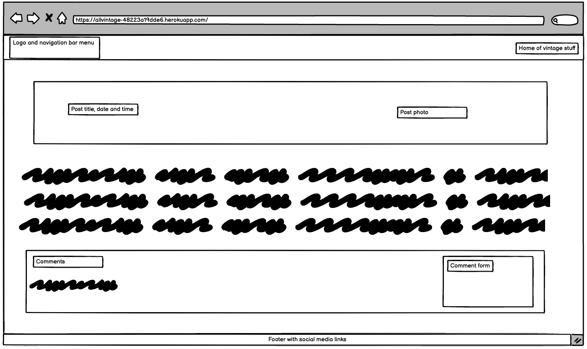

# AllVintage Blog

Home of all vintage stuff.

Please visit the blog [here](https://allvintage-48223a19dde6.herokuapp.com/).

## Project status update

This project has been created for the purpose of completion of Project 4. The base of the project is influenced by Code Institute blog walkthrough project.
In line with Project 4 requirements an addtitional functionality was created to allow users to submit blog content requests.

AllVintage blog is created with the purpose of being a site where users can find interesting articles about old items, and be part of an online community of vintage enthusiastics.  AllVintage blog has a page Administrator, to create, update and delete posts.  Users can sign up, sign in/out, comment and like posts, complete form to suggest posts, engage with other users of the blog community, and engage with the page Administrator.

Due to time constraints and some some challenges with deployment to Heroku, the project is incomplete at the time of the submission.
The remaining aspect, which need to completed are as follows:
-completion of CRUD functonality specifically to allow logged users to delete and amend their comments
-additional styling is required to make the blog more appealing to users
-code testing 
-code commenting across code files
-completion of the readme document, including database schema and wireframes

## Project 4

### Background

## Design 

## Solution 

The solutions below were used for this blog project
-Languages

-Database

-Development

-Deployment and application hosting
The application was deployed, and it is hosted on Heroku.  Further details are documented in the deployment section below.

## Wireframes

In the process of development a subset of wireframes have been created using Balsamiq application.
Wireframes help to visualise the user experience within the application.

Wireframes have been completed for desktop and mobile users.

**Desktop**

Blog's homepage

Blog's posts and comment section

Sign up page

Sign in page

User comment deletion

User comment update

Content request

**Mobile**

All mobile related wireframes are reflected in the image below.

## User stories 

## User Experience 

## Features 

The following features are currently available when accessing the blog.

Homepage

Posts

User comment deletion tab

User comment update tab

User sign up

User sign in

Content request section

Blog page administration

## Potential future developments

This is a list of potential features/enhancements to be developed, in order to improve user's experience within the blog 
*Include the Search function in the navigation bar, to allow users to look for specific items.
*Enlarge blog images
*Include videos in each blog post
*Add a live chat for registered users within the posts, with the aim of enforcing community engagement
*Add section to ask registered users if they wish to be notified each time a new post/article is uploaded/published in the blog

## Testing 

**Functional**

**Responsive user experience**

**Code testing**

**HTML code**

**CSS code**

**JavaScrip code**

**Lighthouse – Dev Tools**

**Bugs**

 **Fixed**

  **Unfixed**

## Deployment

## Credits

Blog images were sourced from Pexels website.

-The project concept was influenced by Code Institute's blog walkthrough project.

Thanky you to Code Institute for module content.

